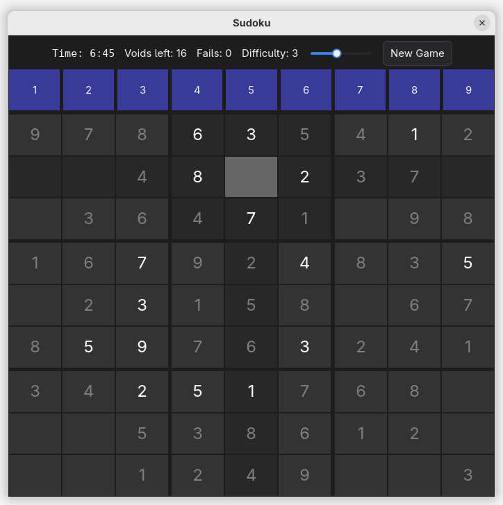

# Xilem Sudoku

A simple Sudoku game written in **Rust** using the **Xilem** GUI framework.
Supports mouse-based play, difficulty selection, conflict highlighting, timers, and a minimal built-in Sudoku generator/solver.



## Features

* Fully playable 9×9 Sudoku
* Difficulty control (level 0–7)
* Conflict detection and highlighting
* Timer and fail counter
* Automatic grid highlighting (row, column, block)
* Pure-Rust Sudoku generator with uniqueness checks
* Clean, modern UI with Xilem 0.4+

## Requirements

* **Rust 1.90 or newer**
* **Xilem ≥ 0.4**
* Other dependencies: `tokio`, `rand`, `vello`, `winit`, `masonry`

To run the game:

```sh
git clone https://github.com/StefanSalewski/xilem-sudoku.git
cd xilem-sudoku
cargo run --release
```

Running in release mode avoids the verbose logging output of masonry.

Tested only for Linux, but might work on Windows and MacOS.

## Resizing Notes

Xilem recently introduced the `resize-observer()` functionality.
An attempt was made to use it for **automatic scaling of Sudoku cell digits** when resizing the window, but as of now it does not behave as expected. Further investigation or upstream improvements may be required.

## License

Dual-licensed under:

* **MIT License**
* **Apache License (Version 2.0)**

Just like most of the Rust ecosystem.

You may choose either license.

